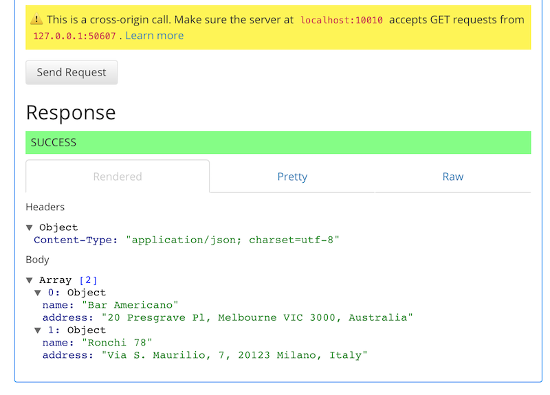

## Introduction and Purpose

Representational state transfer (REST) or RESTful web services are arguably the most popular way of providing interoperability between computer systems on the internet today.

Using HTTP, as is most common, the kind of operations available include those predefined by the HTTP verbs GET, POST, PUT, DELETE and so on. By making use of a stateless protocol and standard operations REST systems aim for fast performance, reliability, and the ability to grow, by using reusable components that can be managed and updated without affecting the system as a whole, even while it is running.

Have a look at good old wikipedia for a ton more info: [REST](https://en.wikipedia.org/wiki/Representational_state_transfer).

There are a number of methods and supporting tools to create REST based APIs.

This tutorial will help you understand a method to quickly create a simple REST API, in order to:

* Understand the REST API mechanism.
* Understand a process of creating a very basic REST API, starting with the API definition (We will use the Swagger definition language - aka the [OpenAPI Specification](http://swagger.io/specification/)).
* Offer up ideas for further additions to the basic REST API that can be investigated to further your knowledge.

_Note to Windows Users:_ This tutorial expects a Unix-like system, however where possible alternatives have been identified for Windows-based systems.  The Windows paths are less tested than the Unix-like paths.

## Objectives of Tutorial

* Learn how to quickly build a REST API
* Package the REST API as a container
* Gain some insight into using environment variables

[item]: # (slide)
## Prerequisites

We give guidance on how best to tackle installing the pre-reqs in Step 0. Here's a list of what we'll need:

* Basic knowledge of `git`: `git` is an open distributed version control system, available [here](https://github.com/) for everyone.
* Docker: Docker is a container engine, available [here](https://www.docker.com/).
* Nodejs (installed with nvm): Nodejs is an engine that enables you to write server-side code in JavaScript.
* swagger-node project: Swagger-node is a framework that enables you to write REST APIs using the Swagger API Description language.

[item]: # (/slide)

## Step 0: Installing Prerequisites

We're going to use the [NodeJS](https://nodejs.org) javascript server-side environment to build our project.  

However, we're not going to build the application from scratch, instead we'll use a few frameworks to speed up the process.  Frameworks are common in application development to remove a lot of the boilerplate code that you might write over-and-over again.  In particular, this project will leverage the [swagger-node](https://github.com/swagger-api/swagger-node) framework which provides tools for designing and building Swagger-compliant REST APIs entirely in Node.js (Swagger-node itself uses a web application framework called [expressjs](https://expressjs.com)!).

Let's install the pre-reqs:

* Install [nvm (node version manager)](https://github.com/creationix/nvm).  Windows users can use: [nvm-windows](https://github.com/coreybutler/nvm-windows)
* Install NodeJS using the command `nvm install node`. This will automatically install npm (node package manager), that we'll use next.
* Install [swagger-node](https://github.com/swagger-api/swagger-node) using `npm install -g swagger`.
* Install [Docker for Mac](https://docs.docker.com/engine/installation/mac/) or [Docker for Windows](https://docs.docker.com/engine/installation/windows/) by downloading the the relevant version for your machine and following the instructions.

[item]: # (slide)
## Step 1: Build our swagger-node project

* Create our first swagger-node Project!

[item]: # (/slide)

### Exercise  

In our first simple step, we'll create the swagger-node project that we'll be using. We do this simply by navigating to the folder we want the swagger-node project to be created in and issuing the command:

`swagger project create rest-api-swagger`

You'll possibly be asked to select a framework for swagger-node to use - we'll use express.js for this tutorial, so go ahead and select:

`Express`

Swagger-node will then scaffold the entire project in a newly created `rest-api-swagger` directory.

Navigate to the new directory:

`cd rest-api-swagger`

Here, we can Initialize a new git repository for our code, should we want to for code source control later:

`git init`

[item]: # (slide)
## Step 2: Get to know our swagger-node project

* Learn about the `swagger-node` project
* Understand the project layout
* Learn about `controllers` and `swagger` swagger project sections

[item]: # (/slide)

### Exercise  

Swagger-node will have created a new template project, which you can then customize to your needs. The structure will look like this:

```
├── README.md
├── api
│   ├── controllers
│   │   ├── README.md
│   │   └── hello_world.js
│   ├── helpers
│   │   └── README.md
│   ├── mocks
│   │   └── README.md
│   └── swagger
│       └── swagger.yaml
├── app.js
├── config
│   ├── README.md
│   └── default.yaml
├── package.json
└── test
    └── api
        ├── controllers
        │   ├── README.md
        │   └── hello_world.js
        └── helpers
            └── README.md
```

Observe that within the main directory there is an `api` directory, that contains folders for `controllers`, `helpers`, `mocks`, `swagger`, and others.

For the purposes of this tutorial, we'll focus our attention on the `controllers` and `swagger` folders:

* `controllers`: ExpressJS is a Model-View-Controller web framework.  The Controller is basically the business logic for the app, where the View is what you ultimately consume as a web page, and Model defines the objects that would be referenced in your View and Controller.  In short, the Controller is somewhat like the glue between the Model and View.

* `swagger`: This directory holds the `swagger.yaml` file, which will provide the definition for your REST API (once you write it!).  We will manipulate this file quite a bit using the Swagger Editor. The Swagger Editor is a browser based editor that allows you to write you API specification and test it from within a single browser window.

[item]: # (slide)
## Step 3: Start Up the Swagger-Node project

* Learn about the `swagger-node` project and CLI

[item]: # (/slide)

### Exercise

Swagger-node provides convenient CLI commands to help you run the project, edit the Swagger.yaml file using swagger editor, and test your API. E.g.

```
    create [options] [name]              Create a folder containing a Swagger project
    start [options] [directory]          Start the project in this or the specified directory
    verify [options] [directory]         Verify that the project is correct (swagger, config, etc)
    edit [options] [directory]           open Swagger editor for this project or the specified project directory
    open [directory]                     open browser as client to the project
    test [options] [directory_or_file]   Run project tests
    generate-test [options] [directory]  Generate the test template
```

Open a new terminal window or tab and change to our swagger-node project directory.

Execute the command: `swagger project start`

You might be prompted to accept incoming network communications. If so, accept.

This will start our swagger node project, bascially creating a local web server app listening on port 10010. You'll see something like this as output:

```
Starting: /Users/<username>/src/rest-api-swagger/app.js...
  project started here: http://localhost:10010/
  project will restart on changes.
  to restart at any time, enter `rs`
try this:
curl http://127.0.0.1:10010/hello?name=Scott

```

Go back to the first terminal window and execute the command

`swagger project edit`

You should see this console output below, and your browser should have loaded the Swagger Editor.

```
Starting Swagger Editor.
Opening browser to: http://127.0.0.1:50391/#/edit
Do not terminate this process or close this window until finished editing.
```


[item]: # (slide)
## Step 4: Understand the project and development process

* Learn about the basics of a Swagger file
* Learn about YAML
* Learn about `paths` and `definitions` swagger project sections

[item]: # (/slide)

### Some background on swagger-node projects...

It's important to realize that the Swagger.yaml file is the focal point of the API Development process. We'll define our REST API here.

You are working in an API-definition-first model, where you add the business logic (the 'do stuff' code) after you define the Swagger file (and your APIs in it) - using this approach means the APIs specifications somewhat drive how your code logic will be written at a later date.

[item]: # (slide)


(Source: Swagger-node project)

[item]: # (/slide)

In order to effectively work with the Swagger definition, it's useful to know more about the relevant parts of the central swagger.yaml file. So here we go...  

`Swagger Object` root: Everything stems from the root "Swagger object".  Before defining the methods of your API, the Swagger file can provide some overall information about your API including: The Swagger version, `info`, `host`, `basePath`, `schemes`, `consumes`, and `produces`.

`paths` section: This object describes the REST API paths that your application will expose to the world.

`definitions` section: The definitions object describes the objects that will be sent into your API methods or returned by your API methods.  It is used by swagger-node to validate what is being provided to, then returned from, the APIs.

If you want to learn about all of the possible options in an OpenAPI specification, you can go [here](http://swagger.io/specification/).  OpenAPI files can be in JSON or [YAML format](http://yaml.org).  The format that we will work in is YAML.  If you're not familiar with YAML, it's a key-value based file format that is easy to read for humans.

[item]: # (slide)
## Step 5: Creating a new API

* Learn about the basic elements of adding an API path to the Swagger file
* Add a `/restaurants` API path to the Swagger file using a code snippet

[item]: # (/slide)

Let's go ahead and start creating a new REST API!

Notice that there is an existing API endpoint called `/hello`, also called a "path object".  It includes a RESTful "operation object" , `get`, which contains two fields: `parameters` and `responses`.

```
paths:
  /hello:
    get:
    		...
    	parameters:
    		...
    	responses:
    		...
```

### Exercise

In the Swagger editor, which should be an open tab in your open web browser now, let's add a new API called `/restaurants`.


Once you have added the `path` named `/restaurants:`, hit RETURN, and then TAB.  


Start typing the word `get`.  You'll noticed that you are presented with an autocomplete option.  Hit TAB to autocomplete the snippet.


The snippet that is added automatically provides summary and description fields as well as a standard default response code for the API (200), where we can specify what we want returned by our API. For this step, well keep the default response.

This is great, however there are a couple of errors to resolve.

To resolve them, add some text to the `summary` and `description` fields.

```
  /restaurants:
    get:
      summary: Displays all of the restaurants available
      description: Displays all of the restaurants available.  These restaurants are fantastic.
      responses:
        200:
          description: OK
```

At this point, you have an API displaying in the Swagger editor (on the right graphical side of the display), but it doesn't do anything.  If you use the Swagger editor to try it out, you'll just get an error.


[item]: # (slide)
# Step 6: Wiring up the controller

* Add controller to our new restaurants API
* Add operation our API should perform within the controller
* Add object definitions to Swagger file

[item]: # (/slide)

In order for your REST API to do something interesting, you need to wire it to a controller.  The Swagger open specification defines an `operationId` field, and the swagger-node project has extended the Swagger specification to also include a reference to the controller the API should use - via the `x-swagger-router-controller` field.

### Exercise

To specify the controller and controller operation our API will use, add the following to your API definition in the swagger file:

* As the first child item of our `/restaurants` API tag, add the new tag and value `x-swagger-router-controller: restaurants`
* As a child item of the `get` tag, after the `description` tag, add the new tag and value `operationId: index`

Your `/restaurants` API path should now resemble this:

```
paths:
  /restaurants:
    x-swagger-router-controller: restaurants
    get:
      summary: Displays all of the restaurants available
      description: Displays all of the restaurants available.  These restaurants are fantastic.
      operationId: index
      ...
```

The next step is to create the controller file in your swagger project that we just pointed our API toward.

Within your project (`rest-api-swagger`), create a file named (via temimal or your favourite text editor) `restaurants.js` under the path `api/controllers/`. This will be our controller file for our API.

Open our controller file `restaurants.js` in a text editor.  

Recall that in the Swagger file, there were two fields: `x-swagger-router-controller` and `operationId`.  We've just created the controller file, now we need to complete the `operationId`.  Since the value of the `operationId` corresponds to `index`, we need to add a function called `index` in `restaurants.js`.

To make it easy in this tutorial and to avoid learning basic javascript, we can copy the code below into `restaurants.js`.


```
'use strict'


module.exports = {
    index: index
};

function index(req, res) {

    var restaurants = [
	{
	    name: 'Bar Americano',
	    address: '20 Presgrave Pl, Melbourne VIC 3000, Australia'
	},
	{
	    name: 'Ronchi 78',
	    address: 'Via S. Maurilio, 7, 20123 Milano, Italy'
	}
    ];

    res.json(restaurants);
}
```

This operation essentially creates an array of two restaurants and sends them back to the calling API.

Save the `restaurants.js` controller file.

Great! Now we have a 'restaurants' API definition, a controller it will call and an operation it will execute.

But we're not quite done.

Head back to the swagger editor. If we try to execute the API, we'll still receive an error in your terminal:

`Error: Response validation failed: void does not allow a value`

This is because our Swagger file does not include a definition for the resulting object (our array of two restaurants) that is returned by the controller/operation when the API is called, and so it's rejecting the result.  

The Swagger-node project has a validation engine for the definitions we create.  These definitions validated against the data that is being submitted into and returned by your API.  Because the data we are returning in the `restaurants.js` controller is an array (of JSON objects), we need to tell Swagger (and our API) what to expect back from the controller.  Looking at one of our restaurant objects defined in the controller operation, we have two properties: `name` and `address`.  Each of those is a `string` type.

```
{
    name: 'Bar Americano',
    address: '20 Presgrave Pl, Melbourne VIC 3000, Australia'
}

```

To address the validation error, we must define a schema definition for the restaurants object the operation `index` is sending back to the server.

In the swagger editior, create a reference (`$ref`) to the `Restaurants` object for our API, by editing the responses section to match the below code snippet:

```
      responses:
        200:
          description: An array of restaurants
          schema:
            $ref: "#/definitions/Restaurants"
```

This code tells our API to expect an object back that matches the schema found in the swagger.yaml file we're editing, within the `definitions` section.

Let's add the `Restaurants` definition we just pointed our API specification to!

As a child of the existing `definitions` tag, toward the bottom of the file, create the definition for the `Restaurants` array (`items`), which in turn points to the items in the array named `Restaurant`:

```
definitions:
  Restaurants:
    items:
      $ref: "#/definitions/Restaurant"
  Restaurant:
    properties:
      name:
        type: string
      address:
        type: string
```

You should now be able to use the Swagger editor to test your API (hopefully successfully).

Add there you have it - your first swagger defined API specification! Congratulations!



[item]: # (slide)
## Step 7: Deploying into Docker

* Create a `Dockerfile`
* Learn to use the basic docker commands (`build`, `run` etc.)

[item]: # (/slide)

You may have heard of Docker before.  In general, Docker is a way to run an application (or part of one) on a system in a "container".  Containers allow you to package all of your application and its dependencies into a logical grouping.  Containers are different from a VM in that they don't include another kernel within the container - Your application is interacting with the kernel of the computer you are running it on.

Containers are much more lightweight and portable, abstracting away the operating system of the VM / Machine below. This makes it great for cloud application developers who need to develop, test and deploy workloads on many different clouds.

Have a look here for more details of what Docker is and does: [What is Docker?](https://www.docker.com/what-docker)

### About the Dockerfile...

This exercise assumes you reviewed the prerequisites, and installed the Docker runtime on your workstation.  

First, in order to package your application and its dependencies into a container:

Create a new file simply called `Dockerfile` at the root of the project (e.g., `rest-api-swagger/Dockerfile`).

A `Dockerfile` has several key components and made up of a series of commands.  It's a bit like a batch script in that sense.  

* First, you need to tell Docker from which image you want to use (and inheret dependencies from).  This saves you the trouble of having to create all of the dependencies by hand.  To do this, you use the `FROM` statement.
* If you want to communicate with your application over a known port, you need to use the `EXPOSE` statement.
* Then, you will supply a series of additional commands to copy your application (your code) and its dependencies into the container.  This will be a combination of `RUN` and `COPY` commands.
* You will also need to tell Docker in which directory to look for your app.  To do this, you use the `WORKDIR` statement.
* Finally, to run your application (or script), you will use the `CMD` statement.

### Create Your Dockerfile

For this tutorial, you can simply copy the following dockerfile example into your own `Dockerfile`:

```
# Dockerfile
FROM node:5.11.1

# Expose the port for the app
EXPOSE 10010

# Create app directory
RUN mkdir -p /usr/src/app

# Establish where your CMD will execute
WORKDIR /usr/src/app

# Install app dependencies

# Note: If you were using a build server, you would do this outside of the
# container, along with tests, and copy the resulting node_modules directory into
# the container.  Since we are just using our local machines, and already have
# downloaded the dependencies, we copy them in the next step.

# COPY package.json /usr/src/app/
# RUN npm install

# Bundle app source into the container
COPY ./node_modules /usr/src/app/node_modules
COPY ./api /usr/src/app/api
COPY ./config /usr/src/app/config
COPY ./app.js /usr/src/app/

# Execute "node app.js"
CMD ["node", "app.js"]
```

Note that we're using `CMD ["node", "app.js"]` as opposed to `CMD ["swagger", "project", "start"]`.  Because the swagger-node project is scaffolding a standard ExpressJS app, to run this app in production, it's recommended to use the `node app.js` method to start the app.

### Build Your Container

To actually create the container, you need to `build` the container using your Dockerfile.  You do this by executing the following command in the base directory of our swagger project:

`docker build -t ciscodevnet/rest-api-swagger:latest .`

This builds our container with the name `ciscodevnet/rest-api-swagger` and tagging it `latest`, which refers to the latest version of this container.

The build might take a little while depending on your network connectivity speed. The output in the terminal will look something like this:

```
$ docker build -t ciscodevnet/rest-api-swagger:latest .
Sending build context to Docker daemon 21.82 MB
Step 1 : FROM node:5.11.1
 ---> 6300cb2bfbd4
Step 2 : EXPOSE 10010
 ---> Running in edcd9edd3b62
 ---> 7d4b0bc05b00
Removing intermediate container edcd9edd3b62
Step 3 : RUN mkdir -p /usr/src/app
 ---> Running in e2f50f313b35
 ---> 69b76c4f6135
Removing intermediate container e2f50f313b35
Step 4 : WORKDIR /usr/src/app
 ---> Running in e70b430dfaef
 ---> dc90db44d9c9
Removing intermediate container e70b430dfaef
Step 5 : COPY ./node_modules /usr/src/app/node_modules
 ---> 53b2e3b48874
Removing intermediate container 7a240a9d3ac8
Step 6 : COPY ./api /usr/src/app/api
 ---> 692a792af429
Removing intermediate container 4febdc35a72d
Step 7 : COPY ./config /usr/src/app/config
 ---> 7b6cdaae20bb
Removing intermediate container e9b304dc6ed9
Step 8 : COPY ./app.js /usr/src/app/
 ---> baf036904254
Removing intermediate container 248f10f4e4b4
Step 9 : CMD node app.js
 ---> Running in b85896eb2d37
 ---> fb421ce7a9d7
Removing intermediate container b85896eb2d37
Successfully built fb421ce7a9d7
```

### Running Our Container

Once you've successfully created the container, you can run the app inside the container!

To do this, use this command:

_Note: Ensure that if you already have docker configured, that DOCKER_CONTENT_TRUST in the docker configuration file is not set._

`docker run --rm --name swagger-default -p 8080:10010	ciscodevnet/rest-api-swagger:latest`

The `-p 8080:10010` flag is mapping the port that you exposed in the Dockerfile (`10010`) to your workstation's port `8080`.

You should now be able to call the API we defined in swagger-node, running on node.js, in a container on your machine, by pointing your browser to:

`http://localhost:8080/restaurants`

or using the `curl` command (which calls our ):

```
$ curl http://localhost:8080/restaurants
[{"name":"Bar Americano","address":"20 Presgrave Pl, Melbourne VIC 3000, Australia"},{"name":"Ronchi 78","address":"Via S. Maurilio, 7, 20123 Milano, Italy"}]%
```

Awesome!!!

### Stopping

To stop your container, open another terminal window, and execute the `docker stop` command:

`docker stop swagger-default`

To then remove your container, execute the `docker remove` command:

`docker rm swagger-default`

[item]: # (slide)
## Step 8: Bonus Round! Docker Makefile

* Learn about how a `Makefile` provides convenience to dev process
* Learn about `Makefile` variables
* Learn about how to pass environment variables and an environment variable file to the `docker` commands

[item]: # (/slide)

It can be tiresome to remember the `docker` commands and syntax.  Creating a `Makefile`, can help remove some of the typos and mundane activites as you work through a project like this.  With a `Makefile`, you can simply type `make` or `make run` in order to build and run your project, respectively.

### Exercises

Create a new file called `Makefile` in the root of the project directory (e.g. in the folder `rest-api-swagger`).

In the `Makefile` contents below, notice that there are a few variables that are set at the top in all caps.  These variable names are mostly taken from the Docker nomenclature for Docker Registries and documentation:

* `NS`: stands for namespace
* `VERSION`: you can set the version of the container that is created or started
* `REPO`: The container repo name
* `NAME`: The shorthand name of the container
* `INSTANCE`: An instance name for the container (not totally necessary, but included for more advanced use cases)
* `PORTS`: The port flag that sets which maps the exposed port to the port on your workstation

**Note: You will need to manually insert the `Makefile` indents to be tabs rather than spaces after each command definition (E.g. after the start of the next line after 'build:' for example - do the same for all similar lines after a command definition) after you copy/paste from below.**

```
NS = ciscodevnet
VERSION ?= latest

REPO = rest-api-swagger
NAME = swagger
INSTANCE = default
PORTS = -p 8080:10010

.PHONY: build push shell run start stop rm release

build:
	docker build -t $(NS)/$(REPO):$(VERSION) .

push:
	docker push $(NS)/$(REPO):$(VERSION)

shell:
	docker run --rm --name $(NAME)-$(INSTANCE) -i -t $(PORTS) $(VOLUMES) $(ENV) $(NS)/$(REPO):$(VERSION) /bin/bash

run:
	docker run --rm --name $(NAME)-$(INSTANCE) $(LINK) $(PORTS) $(VOLUMES) $(ENV) $(NS)/$(REPO):$(VERSION)

start:
	docker run -d --name $(NAME)-$(INSTANCE) $(PORTS) $(LINK) $(VOLUMES) $(ENV) $(NS)/$(REPO):$(VERSION)

stop:
	docker stop $(NAME)-$(INSTANCE)

rm:
	docker rm $(NAME)-$(INSTANCE)

release: build
	make push -e VERSION=$(VERSION)

default: build

```

The `default` make command is to execute `docker build`.  The difference between `make run` and `make start` is that `make start` will daemonize the container, so that it will be running in the background.  The `make shell` command will execute your container, but drop you into the bash shell.  This is very useful for troubleshooting your container via the command line.  You can execute typical bash commands like `ls -l`, check for the existence of environment variables, or run your app manually.

### Environment Variables

It's possible (and highly recommended if you're following the 12factor app patterns) to pass environment variables into your container when it is loaded.  You can do this with the `-e` flag.  If you find yourself using many environment variables, it is more convenient in your development environment to create a file on your workstation containing all of your environment variables.  The format is quite simple, where you define all of your dev environment variables in the standard key-value format (KEY=variable).  You can then use the `--env-file` flag to pass in your environment variables into the container at runtime (`--env-file=./my-vars`).  In the `Makefile`, you can set the `ENV` variable then to `--env-file=./<yourfile>`.

[item]: # (slide)
## Go Do It Exercises

* Refactor the restaurants controller to return one result at the path `restaurants/{restaurantId}`.
* The API doesn't have a notion of persistance.  Using the mongoose ORM, try to add database connectivity to the application.
* Upload your new container image to [Dockerhub](https://hub.docker.com/) for others to see!

[item]: # (/slide)

[item]: # (slide)
## Links to Explore

* https://swaggerhub.com
* https://hub.docker.com


[item]: # (/slide)

## Source code

Source code is available for you as a resource as you work through this tutorial.  You can clone the repository using the following command: `git clone <repo>`.

Once you have cloned the repository, in subsequent steps, you can checkout a portion of the code project that corresponds to the material in the step.  This can help you "catch up" in certain sections if you get behind or stuck.  

You can check out any point of the tutorial using `git checkout -b step? step?`.

To see the changes which between any two lessons use the `git diff command`. `git diff step-?..step-?`.

## License

Unless noted otherwise, this tutorial is provided under the [CC-BY-3.0](https://creativecommons.org/licenses/by/3.0/) license, and any sample code is licensed under [Apache 2.0](LICENSE.md).
