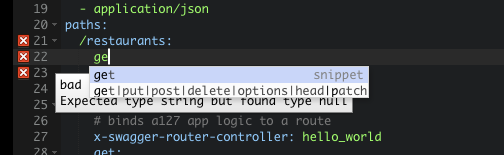
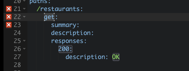

# Introduction and Purpose

The purpose of this tutorial is to help the reader understand a method to quickly create a REST API, and to understand the process of creating an API starting first with the API definintion.  We will use the Swagger definition language (aka the [OpenAPI Specification](http://swagger.io/specification/)) in this tutorial.

## Windows Users

This tutorial expects a Unix-like system, however where possible alternatives have been identified for Windows-based systems.  The Windows paths are less tested than the Unix-like paths.

# Prerequisites

* Nodejs (installed with nvm)
* swagger-node project
* Docker
* Basic knowledge of `git`

[item]: # (slide)
# Objectives of Project

* Learn about how to quickly build a REST API
* Package the REST API as a container
* Understand environment variables

[item]: # (/slide)

# Step 0: Installing Prerequisites

We're going to use the [NodeJS](https://nodejs.org) environment to build our project.  However, we're not going to build the application from scratch, but instead use a few frameworks to speed up the process.  Frameworks are common in application development to remove a lot of the boilerplate code that you might write over-and-over again.  In particular, this project will leverage the [swagger-node](https://github.com/swagger-api/swagger-node) project, which itself uses a web application framework called [expressjs](https://expressjs.com).

* Install NodeJS using [nvm (node version manager)](https://github.com/creationix/nvm).  Windows users can use: [nvm-windows](https://github.com/coreybutler/nvm-windows)
* Install [swagger-node](https://github.com/swagger-api/swagger-node)
* Install [Docker for Mac](https://docs.docker.com/engine/installation/mac/) or [Docker for Windows](https://docs.docker.com/engine/installation/windows/)

[item]: # (slide)
# Step 1: Create swagger-node project
[item]: # (/slide)

* `$ npm install -g swagger`: Installs the swagger framework globally
* `$ swagger project create rest-api-swagger`: Scaffolds the entire project in a newly created `rest-api-swagger` directory
* `$ cd rest-api-swagger`
* `$ git init`: Initialize the git repo for this project

[item]: # (slide)
# Step 2: Exploring the project layout
[item]: # (/slide)

Swagger-node will create a template project for you to fill in the gaps.  Observe that there is an `api` directory, that contains folders for `controllers`, `helpers`, `mocks`, `swagger`, and others.

Focusing our attention on `controllers` and `swagger`:

[item]: # (slide)

* `controllers`: ExpressJS is a Model-View-Controller web framework.  The Controller is basically the business logic for the app, where the View is what you ultimately consume as a web page, and Model defines the objects that would be referenced in your View and Controller.  In short, the Controller is somewhat like the glue between the Model and View.

* `swagger`: This directory holds the `swagger.yaml` file, which provides the definition for your REST API.  We will manipulate this file quite a bit using the Swagger Editor.

[item]: # (/slide)

```
├── README.md
├── api
│   ├── controllers
│   │   ├── README.md
│   │   └── hello_world.js
│   ├── helpers
│   │   └── README.md
│   ├── mocks
│   │   └── README.md
│   └── swagger
│       └── swagger.yaml
├── app.js
├── config
│   ├── README.md
│   └── default.yaml
├── package.json
└── test
    └── api
        ├── controllers
        │   ├── README.md
        │   └── hello_world.js
        └── helpers
            └── README.md
```

[item]: # (slide)
# Step 3: Run the project


Swagger-node provides convenient CLI commands to help you run the project, edit the Swagger file using swagger editor, and test your API.

```
    create [options] [name]              Create a folder containing a Swagger project
    start [options] [directory]          Start the project in this or the specified directory
    verify [options] [directory]         Verify that the project is correct (swagger, config, etc)
    edit [options] [directory]           open Swagger editor for this project or the specified project directory
    open [directory]                     open browser as client to the project
    test [options] [directory_or_file]   Run project tests
    generate-test [options] [directory]  Generate the test template
```

[item]: # (/slide)

## Exercise

* Open another terminal windows or tab
* In the new terminal, change to the project directory
* Execute the command `swagger project start`
* In the first terminal window, execute the command `swagger project edit`

In the window where you entered the command `swagger project start`, you should see console output:

```
Starting: /Users/<username>/src/rest-api-swagger/app.js...
  project started here: http://localhost:10010/
  project will restart on changes.
  to restart at any time, enter `rs`
try this:
curl http://127.0.0.1:10010/hello?name=Scott

```

In the window where you entered the command `swagger project edit`, you should see this console output, and your browser should have loaded the editor.

```
Starting Swagger Editor.
Opening browser to: http://127.0.0.1:50391/#/edit
Do not terminate this process or close this window until finished editing.
```


[item]: # (slide)
# Step 4: Understand the project and development process
[item]: # (/slide)

[item]: # (slide)

(Source: Swagger-node project)

[item]: # (/slide)

It's important to realize that the Swagger file is the focal point of the process.  You are working in an API-definition-first model, and adding business logic to your code as a result of what you define in the Swagger file.

[item]: # (slide)
## Swagger file details
[item]: # (/slide)
In order to effectively work with the Swagger definition, it's useful to know more about the relevant parts of the file.  If you want to learn about all of the possible options in an OpenAPI specification, you can go [here](http://swagger.io/specification/).  OpenAPI files can be in JSON or [YAML format](http://yaml.org).  The format that we will work in is YAML.  If you're not familiar with YAML, it's a key-value based file format that is easy to read for humans.

[item]: # (slide)
Beginning section: Everything stems from the root "Swagger object".  Before defining the methods of your API, the Swagger file can provide some overall information about your API including: The Swagger version, `info`, `host`, `basePath`, `schemes`, `consumes`, and `produces`.

[item]: # (/slide)

[item]: # (slide)
`paths` section: This object describes the REST API paths that your application will expose to the world.

[item]: # (/slide)
[item]: # (slide)
`definitions` section: This object describes the objects that will be sent into your API methods or returned by your API methods.  It is used by the swagger "middleware" to validate what is being provided to and returned from the API.

[item]: # (/slide)

[item]: # (slide)
## Step 4: Summary

* Learned about the basics of a Swagger file
* Learned about YAML
* Learned about `paths` and `definitions` sections

[item]: # (/slide)

[item]: # (slide)
# Step 5: Creating a new API
[item]: # (/slide)

Notice that there is an existing endpoint called `/hello`, also called a "path object".  It includes an "operation object" , `get`, which contains two fields: `parameters` and `responses`. 

[item]: # (slide)
```
paths:
  /hello:
    get:
    		...
    	parameters:
    		...
    	responses:
    		...
```
[item]: # (/slide)

Let's add a new API.  In the Swagger editor, which should be a tab in your open web browser already, add a new API called `/restaurants`.


Once you have added the `path` named `/restaurants:`, hit RETURN, and then TAB.  



Start typing the word `get`.  You'll noticed that you are presented with an autocomplete option.  Hit TAB to autocomplete the snippet.



This is great, however there are a couple of errors to resolve.

[item]: # (slide)
Add some text to the `summary` and `description` fields.

```
  /restaurants:
    get:
      summary: Displays all of the restaurants available
      description: Displays all of the restaurants available.  These restaurants are fantastic.
      responses:
        200:
          description: OK
```
[item]: # (/slide)

[item]: # (slide)
## Step 5: Summary

* Learned about the basic elements of adding a path to the Swagger file
* Added a `/restaurants` path to the Swagger file using snippet

[item]: # (/slide)

[item]: # (slide)
# Step 6: Wiring up the controller
[item]: # (/slide)

At this point, you have an API displaying in the Swagger editor, but it doesn't do anything.  If you use the Swagger editor to try it out, you'll just get an error.

In order for your REST API to do something interesting, you need to wire it to a controller.  The Swagger spec defines an `operationId` field, and the swagger-node project has extended the Swagger spec to also include a reference to the controller via the `x-swagger-router-controller` field.

[item]: # (slide)
Add the following to your Swagger file:

* `x-swagger-router-controller: restaurants`
* `operationId: index`

[item]: # (/slide)

The next step is to create the controller in your project.

In the terminal, and within your project (`rest-api-swagger`), create a file named `restaurants.js` in the path `api/controllers/`.

Open `restaurants.js` in a text editor.  Recall that in the Swagger file, there were two fields: `x-swagger-router-controller` and `operationId`.  We've already created the controller file, now we need to complete the `operationId`.  Since the value of the `operationId` corresponds to `index`, we need to add a function called `index` in `restaurants.js`.

Copy the content below into `restaurants.js`.


```
'use strict'


module.exports = {
    index: index
};

function index(req, res) {

    var restaurants = [
	{
	    name: 'Bar Americano',
	    address: '20 Presgrave Pl, Melbourne VIC 3000, Australia'
	},
	{
	    name: 'Ronchi 78',
	    address: 'Via S. Maurilio, 7, 20123 Milano, Italy'
	}
    ];
    
    res.json(restaurants);
}
```

If you try to execute the API, however, you'll receive an error in your terminal:

`Error: Response validation failed: void does not allow a value`

This is because our Swagger file does not include a definition for the resulting object, and so it's rejecting the result.

To address this, we must define a schema definition for the restaurants object the `index` is sending back to the server.

```
      responses:
        200:
          description: An array of restaurants
          schema:
            $ref: "#/definitions/Restaurants"
```

```
definitions:
  Restaurants:
    items:
      $ref: "#/definitions/Restaurant"
  Restaurant:
    properties:
      name:
        type: string
      address:
        type: string 
```

[item]: # (slide)
## Step 6 Summary

* Added `x-swagger-router-controller: restaurants`
* Added `operationId: index`
* Added `api/controllers/restaurants.js`
* Added `function index({})` to `restaurants.js`
* Added object definitions to Swagger file

[item]: # (/slide)

# Step 7: Deploying into Docker

# Step 8: Bonus: Docker Makefile

# Go do it Exercises

* The API doesn't have a notion of persistance.  Using the mongoose ORM, try to add database connectivity to the application.
* 


# Links to Explore

* https://swaggerhub.com

# License

Unless noted otherwise, this tutorial is provided under the [CC-BY-3.0](https://creativecommons.org/licenses/by/3.0/) license, and any sample code is licensed under [Apache 2.0](LICENSE.md).
